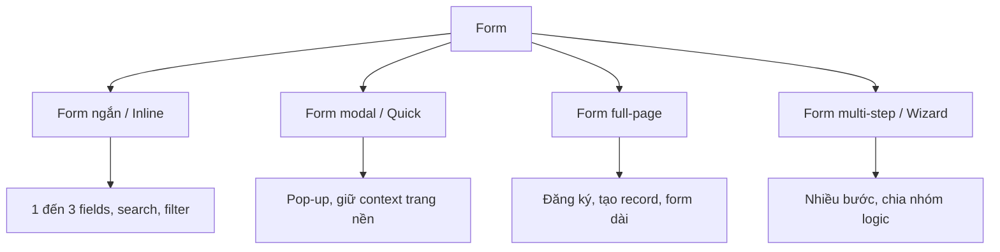
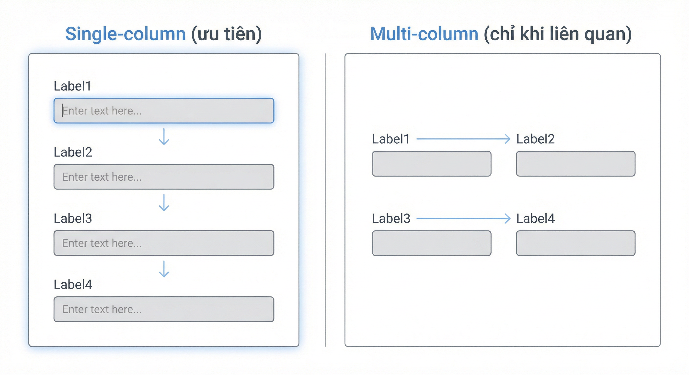
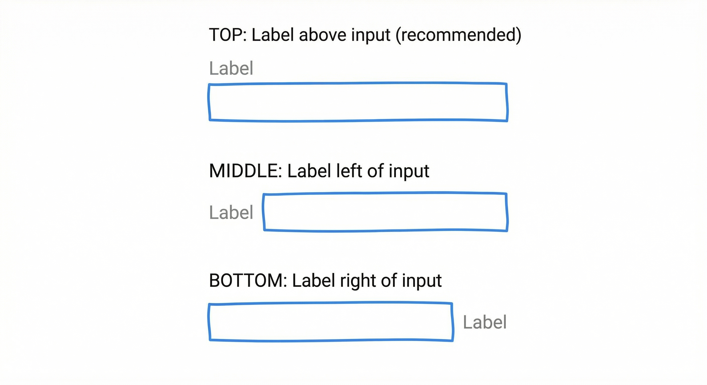

# Hướng dẫn Thiết kế Form theo Chuẩn UX/UI Best Practices

Tài liệu tổng hợp các quy tắc thiết kế form thân thiện với người dùng, từ tổng quan đến chi tiết từng loại field, có giải thích lý do và dẫn chứng từ các nguồn uy tín.

---

## Mục lục

**Phần I – Tổng quan**
1. [Tổng quan](#1-tổng-quan)
2. [Phân loại form theo bố cục](#2-phân-loại-form-theo-bố-cục)

**Phần II – Cấu trúc và Bố cục**
3. [Cấu trúc Form – Container, Chia cột, Section](#3-cấu-trúc-form--container-chia-cột-section)
4. [Spacing và Whitespace](#4-spacing-và-whitespace)

**Phần III – Quy tắc chung**
5. [Quy tắc chung](#5-quy-tắc-chung)
6. [Typography và Visual States](#6-typography-và-visual-states)

**Phần IV – Chi tiết theo loại Field**
7. [Field Text và Email](#7-field-text-và-email)
8. [Field Number](#8-field-number)
9. [Field Date](#9-field-date)
10. [Field Số điện thoại (Phone)](#10-field-số-điện-thoại-phone)
11. [Field Mật khẩu (Password)](#11-field-mật-khẩu-password)
12. [Field Textarea](#12-field-textarea)
13. [Select / Dropdown](#13-select--dropdown)
14. [Checkbox và Radio (chi tiết)](#14-checkbox-và-radio-chi-tiết)
15. [Autocomplete](#15-autocomplete)
16. [Field File Upload](#16-field-file-upload)
17. [Character limit và Maxlength](#17-character-limit-và-maxlength)

**Phần V – Kích thước, Thứ tự, Help**
18. [Kích thước Input và Touch Targets](#18-kích-thước-input-và-touch-targets)
19. [Thứ tự và Cấu trúc Field](#19-thứ-tự-và-cấu-trúc-field)
20. [Helper Text và Help](#20-helper-text-và-help)

**Phần VI – Validation, Buttons, Accessibility**
21. [Validation và Error Handling](#21-validation-và-error-handling)
22. [Buttons](#22-buttons)
23. [Keyboard, Tab order, Autocomplete attribute](#23-keyboard-tab-order-autocomplete-attribute)

**Phần VII – Các pattern khác**
24. [Progressive Disclosure](#24-progressive-disclosure)
25. [Số lượng Field và Conversion](#25-số-lượng-field-và-conversion)
26. [Quy tắc riêng theo loại form](#26-quy-tắc-riêng-theo-loại-form)
27. [Tránh sai lầm phổ biến](#27-tránh-sai-lầm-phổ-biến)
28. [Nguồn tham khảo](#28-nguồn-tham-khảo)
29. [Page Layout (Create/Edit/Detail)](#29-page-layout-createeditdetail)

---

## 1. Tổng quan

### 1.1 Mục đích tài liệu

Tài liệu này cung cấp:

- Quy tắc chung và quy tắc chi tiết theo từng loại field
- Hướng dẫn cấu trúc, bố cục, chia cột
- Giải thích **tại sao** cần làm theo từng quy tắc
- Dẫn chứng từ nghiên cứu, design system và tài liệu UX uy tín

### 1.2 Tại sao thiết kế form quan trọng?

Nghiên cứu của Seckler và cộng sự (CHI 2014) cho thấy: khi form tuân thủ các guideline usability cơ bản, **78%** người dùng submit thành công ngay lần đầu; với form vi phạm guideline, tỷ lệ này chỉ còn **42%**.

> Nguồn: Mirjam Seckler et al., "Designing usable web forms: empirical evaluation of web form improvement guidelines", SIGCHI Conference on Human Factors in Computing Systems 2014.

Gần 70% người dùng bỏ form khi form gây khó hiểu hoặc thất vọng. Thiết kế form kém làm giảm conversion, tăng thời gian hoàn thành và tạo trải nghiệm tiêu cực.

📷 **Xem minh họa:** [NN/G – Website Forms Usability: Top 10 Recommendations](https://www.nngroup.com/articles/web-form-design/) — 10 khuyến nghị với screenshot form tốt/xấu

### 1.3 Nguyên tắc cốt lõi (2024+)

- **Giảm effort**: Chỉ hỏi thông tin cần thiết; dùng smart defaults, autocomplete, input phù hợp thiết bị
- **Rõ ràng**: Label đơn giản, ví dụ cụ thể; không dùng placeholder thay label
- **Ngăn lỗi sớm**: Validate inline (on blur), hướng dẫn cụ thể
- **Accessibility**: Semantic HTML, label hiển thị, tuân thủ WCAG 2.2
- **Tôn trọng quyền riêng tư**: Thu thập tối thiểu, giải thích mục đích

**Dẫn chứng:** FormCreatorAI – Web Form Design Best Practices; Interaction Design Foundation – UI Form Design; Primer – Forms

---

## 2. Phân loại form theo bố cục



| Loại form | Số lượng field | Bối cảnh | Ví dụ |
|-----------|----------------|----------|-------|
| **Form ngắn / Inline** | 1–3 | Tìm kiếm, lọc, đăng nhập | Search bar, filter, login |
| **Form modal** | Thường &lt; 5–6 | Task nhỏ, giữ context | Tạo Contact nhanh, xác nhận |
| **Form full-page** | Bất kỳ | Đăng ký, tạo record | Tạo Department, đăng ký tài khoản |
| **Form multi-step (Wizard)** | Nhiều, chia nhóm | Form dài, thứ tự logic | Đăng ký vay, khảo sát |

### 2.1 Khi nào dùng Modal vs Full-page?

**Modal:** Task nhỏ (&lt; 5–6 field), cần giữ context nền, hành động bổ sung.

**Full-page:** Form nhiều field, user cần nhớ thông tin từ màn trước, không cần gián đoạn luồng.

📷 **Xem minh họa:** [UX Planet – Modal vs Page](https://uxplanet.org/modal-vs-page-a-decision-framework-75843c4b322f) — So sánh khi nào dùng modal vs trang riêng

**Dẫn chứng:** UX Planet – Modal vs Page; UX Stack Exchange – Forms: Modal dialog or separate page?

---

## 3. Cấu trúc Form – Container, Chia cột, Section

### 3.1 Max-width container

**Quy tắc:** Max-width form **40–50em** (đơn vị tương đối). Tránh form full-width trên màn hình lớn.

**Tại sao:** Độ dài dòng 45–75 ký tự (tối đa ~80) tốt cho đọc. `em` scale theo font size của user.

**Thực hành:** Mobile dùng 100% width; min-width ~320px.

📷 **Xem minh họa:** [Carbon Design System – Form](https://carbondesignsystem.com/components/form/usage) — Max-width, spacing, layout

**Dẫn chứng:** UX Stack Exchange – Suggestion required for max width of a form; Newtarget – Max-Content Width

### 3.2 Chia cột (Column layout)

**Nguyên tắc chung:** Ưu tiên **single-column**. Form 1 cột hoàn thành nhanh hơn ~15.4 giây so với multi-column (CXL, 95% confidence).

**Khi được phép 2 cột:** Chỉ khi các field **liên quan chặt**:
- City + State + Zip
- First Name + Last Name
- Start date + End date
- Parent + Level (hierarchy)

**Hướng đọc:** Luồng **dọc trước** (top-to-bottom) rồi mới sang cột kế bên. Dùng visual separator giữa hai cột.

**Cảnh báo:** Tránh 2 cột với form dài (20+ field) – user dễ bỏ qua cột phải. Trên mobile chuyển về 1 cột.



**Dẫn chứng:** Caroline Jarrett – Two-column forms best avoided; UX Stack Exchange – 2 column form logical order

### 3.3 Form Section và Divider

**Quy tắc:**
- Nhóm field theo **chủ đề logic** với heading rõ ràng
- Dùng `<fieldset>` + `<legend>` cho accessibility
- Divider (line) hoặc spacer giữa section; tối đa 3 cấp heading

**Tại sao:** Cấu trúc rõ ràng giúp quét nhanh và hỗ trợ screen reader.

📷 **Xem minh họa:** [W3C – Grouping Controls](https://www.w3.org/WAI/tutorials/forms/grouping/) — fieldset, legend, nhóm field

**Dẫn chứng:** W3C – Grouping Controls; ActivityInfo – Section header field

---

## 4. Spacing và Whitespace

### 4.1 Nguyên tắc Proximity (Gestalt)

Các phần tử **gần nhau** được nhận thức là **liên quan**. Label phải gần field của nó hơn field khác.

### 4.2 Macro vs Micro whitespace

- **Macro**: Khoảng cách giữa section, margin quanh form
- **Micro**: Padding trong input, khoảng cách label–field, line-height

### 4.3 Tác động

Whitespace hợp lý có thể tăng comprehension ~20% và conversion từ ~6% lên hơn 15%. Dùng grid 4px hoặc 8px.

📷 **Xem minh họa:** [NN/G – Form Design White Space](https://www.nngroup.com/articles/form-design-white-space/) — Khoảng cách macro/micro, ví dụ trước/sau

**Dẫn chứng:** NN/G – Form Design White Space; UsePixelForm – Using Whitespace and Layout

---

## 5. Quy tắc chung

### 5.1 Label – Đặt trên input, không dùng placeholder thay label

**Quy tắc:** Mỗi input có label rõ ràng **phía trên** field. Không dùng placeholder thay label.

**Tại sao:** Placeholder biến mất khi gõ, độ tương phản thấp, screen reader không đọc; user dễ nhầm.

📷 **Xem minh họa:** [NN/G – Placeholders in Form Fields Are Harmful](https://www.nngroup.com/articles/form-design-placeholders/) — So sánh placeholder vs label, ví dụ cụ thể

**Dẫn chứng:** NN/G – Placeholders in Form Fields Are Harmful; Adam Silver – The problem with placeholders

### 5.2 Layout – Ưu tiên single-column

Sắp xếp fields một cột dọc. Ngoại lệ: City+State+Zip, Start+End date có thể cùng hàng trên desktop.

### 5.3 Required / Optional

Đánh dấu **optional** khi đa số là required. Tránh hướng dẫn chung ở đầu form. Giảm optional field tối đa.

📷 **Xem minh họa:** [NN/G – Marking Required Fields](https://www.nngroup.com/articles/required-fields/) — Cách đánh dấu required/optional

**Dẫn chứng:** NN/G – Marking Required Fields; UXD World – Required and Optional Fields

### 5.4 Button text – Động từ mô tả hành động

Dùng "Tạo phòng ban", "Lưu thay đổi" thay vì "Submit", "Gửi".

### 5.5 Vị trí Label

Label **phía trên** field là tốt nhất cho hầu hết form, đặc biệt mobile. Label bên trái tiết kiệm chiều dọc nhưng chậm hơn.



**Dẫn chứng:** Baymard – Label Position; UXmatters – Label Placement in Forms

---

## 6. Typography và Visual States

### 6.1 Typography

| Thành phần | Font size | Ghi chú |
|------------|-----------|---------|
| Label | 12px / 0.75rem | Regular weight |
| Nội dung input | 14px / 0.875rem | Regular |
| Helper/Error | 12px / 0.75rem | Regular |
| Section heading | 16–18px | Semibold |

Label: sentence case, ngắn gọn (≤3 từ). Khoảng cách dọc giữa field: ~32px.

📷 **Xem minh họa:** [Material Design – Text fields](https://m3.material.io/components/text-fields) — Typography, states, variants

**Dẫn chứng:** Carbon Design System – Form style; web.dev – Design basics; Primer – Forms

### 6.2 Border input

Input cần **border rõ ràng** để trông như control tương tác. Border mặc định browser thường quá nhạt, ảnh hưởng usability trên mobile. Dùng `border: 1px solid` với màu đủ tương phản.

📷 **Xem minh họa:** [web.dev – Styling forms](https://web.dev/learn/forms/styling/) — Border, focus, states

**Dẫn chứng:** web.dev – Styling forms; W3C Design System – Forms

### 6.3 Focus state

**Quy tắc:** Có focus indicator rõ (outline hoặc box-shadow). Dùng `:focus-visible` thay vì `:focus` – hiện khi dùng keyboard, ẩn khi click chuột.

**Tại sao:** Người dùng keyboard cần biết vị trí focus. WCAG 2.2 yêu cầu focus rõ ràng. Không gỡ focus nếu không có thay thế.

📷 **Xem minh họa:** [web.dev – Focus visible](https://web.dev/focus-visible/) — Focus ring, :focus-visible

**Dẫn chứng:** WICG – focus-visible; Cr0x – Accessible Focus States; Bootstrap – Focus ring

### 6.4 Disabled state

**Quy tắc:** Tránh chỉ dùng màu xám – dễ nhầm với nút secondary. Cân nhắc **giảm opacity** (&lt; 40%) thay vì đổi màu hẳn.

**Tại sao:** Opacity tạo chuyển đổi mượt hơn; màu xám khiến nút "nổi" và dễ bị click nhầm.

📷 **Xem minh họa:** [UX Movement – Disabled Buttons](https://uxmovement.com/buttons/why-you-shouldnt-gray-out-disabled-buttons/) — Opacity vs gray

**Dẫn chứng:** UX Movement – Why You Shouldn't Gray Out Disabled Buttons; Smashing Magazine – Usability Pitfalls of Disabled Buttons

---

## 7. Field Text và Email

### 7.1 Text

Label trên field; chiều rộng phù hợp độ dài dự kiến; không dùng placeholder thay label.

### 7.2 Email

**Quy tắc:**
- Dùng `<input type="email">` – keyboard phù hợp mobile, validation cơ bản
- Kết hợp client-side + server-side validation
- `autocomplete="email"` cho WCAG

📷 **Xem minh họa:** [web.dev – Form design basics](https://web.dev/learn/forms/form-structure/) — Input types, labels, structure

**Dẫn chứng:** WebAIM – Form Validation; W3C – Validating Input; UXPin – Accessible Form Validation

---

## 8. Field Number

### 8.1 Width

Tương ứng độ dài dự kiến: 75–100px (số ngắn), 150px (trung bình), 200–250px (dài).

### 8.2 Text alignment

**Căn phải (right-align)** khi so sánh nhiều số (vd: bảng tài chính). **Căn trái** khi form đa dạng, ưu tiên đồng bộ với text field.

**Dẫn chứng:** UX Stack Exchange – Why aren't number inputs right aligned

### 8.3 Standard width (FCC Design Standards)

| Size | Width |
|------|-------|
| Extra Small | 75px |
| Small | 150px |
| Medium | 250px |
| Large | 350px |
| Fill | 100% |

📷 **Xem minh họa:** [USWDS – Form controls](https://designsystem.digital.gov/components/form-controls/) — Width, alignment

---

## 9. Field Date

### 9.1 Width

Single field: 150–250px. Date range: hai field cùng hàng desktop, mỗi cái ~150–200px.

### 9.2 Pattern theo context

| Context | Pattern |
|---------|---------|
| Ngày gần (&lt; 1 năm) | Calendar picker |
| Ngày xa (vd: năm sinh) | Cho phép gõ |
| Ít option (3–10 ngày) | Danh sách lựa chọn |

### 9.3 NN/G – Date Input Guidelines

- **Tránh** split dropdown (tháng/ngày/năm riêng) – tăng interaction cost
- **Tránh** scrolling picker trên mobile cho ngày xa
- **Luôn cho phép gõ** ngày
- **Không ép format** – chấp nhận 9-3-17, 09/03/17
- User quốc tế: label rõ (Month, Day) hoặc viết tên tháng
- Ngày không hợp lệ: disable hoặc làm rõ

📷 **Xem minh họa:** [NN/G – Date-Input Form Fields](https://www.nngroup.com/articles/date-input/) — Calendar, split dropdown, format; [PatternFly – Date Picker](https://patternfly.org/components/date-picker)

**Dẫn chứng:** NN/G – [Date-Input Form Fields](https://www.nngroup.com/articles/date-input/); PatternFly – Date Picker

---

## 10. Field Số điện thoại (Phone)

**Quy tắc:**
- Chuẩn E.164: country code + tối đa 15 số
- Country dropdown + 1 field nhập số
- `autocomplete="tel"`
- Chấp nhận format linh hoạt (dấu cách, gạch); validate server-side

📷 **Xem minh họa:** [Base Web – Phone Input](https://baseweb.design/components/phone-input/) — Country dropdown + field

**Dẫn chứng:** Base Web – Building an International Phone Input; UX Patterns – Phone Number

---

## 11. Field Mật khẩu (Password)

**Quy tắc:**
- Có nút **show/hide** password
- Hiển thị yêu cầu **trước** khi nhập
- `aria-describedby` gắn yêu cầu với input
- Không tắt autofill trừ khi lý do bảo mật rõ ràng

**Tại sao:** Giúp kiểm tra nhập đúng; hữu ích cho người khuyết tật.

📷 **Xem minh họa:** [Material Design – Password text field](https://m3.material.io/components/text-fields/guidelines#d09f2686-07c4-4b4c-a8d3-b1ee53a46d63) — Show/hide, requirements

**Dẫn chứng:** UX Patterns – Password; Makethingsaccessible – Accessible password reveal input

---

## 12. Field Textarea

**Quy tắc:**
- Dùng `rows`/`cols` (HTML) và CSS; `cols` kém tin cậy nên ưu tiên CSS
- Ví dụ: `width: 300px`, `height: 150px`; responsive trên mobile
- Autoresize: tăng height theo nội dung, có `minRows` và `maxRows`

📷 **Xem minh họa:** [MUI – Textarea Autosize](https://mui.com/material-ui/react-text-field/#multiline) — Multiline, autoresize

**Dẫn chứng:** UX Patterns – Textarea; MUI – Textarea Autosize

---

## 13. Select / Dropdown

### 13.1 Khi nào dùng

- **&lt; 6 options** → Radio buttons
- **7+ options** → Dropdown hoặc Autocomplete

### 13.2 Behavior

- Dùng **mousedown** thay vì click để mở – mở trước khi nhả chuột
- Khi mở: scroll đến item đang chọn
- Typeahead để tìm nhanh
- Trên mobile: ưu tiên native `<select>`
- Menu ~7 items trở xuống; nhiều hơn: nhóm hoặc scroll

📷 **Xem minh họa:** [NN/G – Dropdowns](https://www.nngroup.com/articles/drop-down-menus/) — Khi dùng dropdown; [PatternFly – Select](https://patternfly.org/components/select)

**Dẫn chứng:** UI Playbook – Select; PatternFly – Select; NN/G – Dropdowns

---

## 14. Checkbox và Radio (chi tiết)

### 14.1 NN/G – Checkbox Guidelines

- **Hình dạng:** Vuông (có thể bo góc); **không** dùng hình tròn (dễ nhầm radio)
- **Label clickable** – vùng chạm ≥ 1cm x 1cm
- **Label tránh phủ định** – "Gửi cập nhật" thay vì "Không gửi cập nhật"
- **Checkbox list:** Xếp **dọc**, không ngang
- Ghi rõ "Chọn tất cả phù hợp" hoặc "Chọn tối đa X"
- **Checkbox khuyến mãi/legal:** Mặc định **unchecked** (tránh deceptive pattern)

### 14.2 Nested checkbox

Parent + child; parent có trạng thái **indeterminate** (gạch) khi chỉ một phần con được chọn. Dùng khi nhiều user chọn "tất cả".

### 14.3 Radio vs Checkbox

- **Radio:** Chọn **một** (mutually exclusive)
- **Checkbox:** Chọn **nhiều** hoặc bật/tắt (boolean)

📷 **Xem minh họa:** [NN/G – Checkboxes: Design Guidelines](https://www.nngroup.com/articles/checkboxes-design-guidelines/) — Hình vuông vs tròn, nested, indeterminate; [PatternFly – Checkbox](https://patternfly.org/components/forms/checkbox/design-guidelines)

**Dẫn chứng:** NN/G – [Checkboxes: Design Guidelines](https://www.nngroup.com/articles/checkboxes-design-guidelines/); Canada.ca – Checkboxes and radio buttons

---

## 15. Autocomplete

**Khi dùng:** 10+ options, input có tập giá trị xác định (vd: thành phố, sản phẩm).

**Khi không:** &lt; 10 options; text tự do; mật khẩu; độ trễ mạng cao.

**Accessibility:** HTML `autocomplete`, ARIA; điều hướng phím (mũi tên, Enter).

📷 **Xem minh họa:** [Primer – Autocomplete](https://primer.style/product/components/autocomplete/guidelines); [Material Design – Autocomplete](https://m3.material.io/components/text-fields/guidelines#17c85694-f8b6-4024-9627-34e6d1d15f50)

---

## 16. Field File Upload

**Quy tắc:**
- Label rõ; helper text mô tả giới hạn (loại file, kích thước)
- Single upload mặc định; `multiple` khi cần
- Cân nhắc drag-and-drop
- Nút "Chọn file" / "Upload file" rõ ràng
- `accept` attribute; validate server-side
- Hiển thị progress và lỗi

📷 **Xem minh họa:** [GOV.UK – File upload](https://design-system.service.gov.uk/components/file-upload/) — Label, hint, drag-drop; [Michigan Design System – File Upload](https://designsystem.michigan.gov/components/form-elements/file-upload/)

**Dẫn chứng:** GOV.UK – File upload; UX Patterns – File Input; Michigan Design System – File Upload

---

## 17. Character limit và Maxlength

**Quy tắc:**
- Hiển thị giới hạn **từ đầu**, không chỉ khi submit
- Đếm: "X/Y ký tự" hoặc "Còn Y ký tự"
- Khi sắp chạm limit: đổi màu (vd: cam, đỏ)
- Vượt quá: "Vượt X ký tự" – rõ ràng

📷 **Xem minh họa:** [USWDS – Character count](https://designsystem.digital.gov/components/character-count/) — Đếm ký tự, màu sắc khi gần limit

**Dẫn chứng:** USWDS – Character count; UX Stack Exchange – Text box max character limit

---

## 18. Kích thước Input và Touch Targets

### 18.1 Chiều rộng

Tương ứng độ dài dự kiến. Cân bằng giữa đúng kích thước và **đồng nhất** – form đồng đều trông chuyên nghiệp hơn.

### 18.2 Touch target (Mobile)

**WCAG 2.1/2.2 (AAA):** Tối thiểu **44x44 CSS pixels**. Material Design: **48x48 dp**. Khoảng cách giữa target: 8px.

📷 **Xem minh họa:** [web.dev – Accessible tap targets](https://web.dev/accessible-tap-targets/) — 44x44px, spacing; [W3C – Target Size](https://www.w3.org/WAI/WCAG22/Understanding/target-size.html)

**Dẫn chứng:** W3C – Target Size; web.dev – Accessible tap targets

---

## 19. Thứ tự và Cấu trúc Field

- Nhóm theo **chủ đề logic**
- **Tổng quát → cụ thể** – bắt đầu câu hỏi rộng, dần sang riêng tư
- Luồng **logic** – thông tin này dẫn đến thông tin kia
- Giảm cognitive load với heading rõ ràng

📷 **Xem minh họa:** [NN/G – 4 Principles to Reduce Cognitive Load](https://www.nngroup.com/articles/cognitive-load/) — Nhóm logic, thứ tự field

**Dẫn chứng:** Formcentric – Getting the order right; NN/G – 4 Principles to Reduce Cognitive Load

---

## 20. Helper Text và Help

- Đặt **bên dưới** field: Label → Input → Helper text
- Dùng cho input phức tạp, ràng buộc, giới hạn ký tự
- **Tránh** tooltip thay helper text – helper text luôn hiển thị hiệu quả hơn

📷 **Xem minh họa:** [PatternFly – Helper Text](https://patternfly.org/components/forms/helper-text); [UX Movement – Form Field Help Text](https://uxmovement.com/forms/why-infield-top-aligned-form-labels-win/)

**Dẫn chứng:** UX Movement – Form Field Help Text; PatternFly – Helper Text

---

## 21. Validation và Error Handling

### 21.1 Inline validation

Hiển thị lỗi **dưới field** khi blur. Không validate khi đang gõ (trừ password strength).

### 21.2 10 guideline NN/G

1. Inline validation khi có thể
2. Chỉ báo thành công cho field phức tạp
3. Message ngay field – rõ ràng, có thể hành động
4. Màu + icon (không chỉ màu)
5. Icon hoặc animation nhẹ
6. Hạn chế modal cho lỗi
7. Không validate trước khi user xong
8. Không chỉ dùng validation summary
9. Tránh tooltip cho lỗi
10. Hỗ trợ khi lỗi lặp lại

📷 **Xem minh họa:** [NN/G – 10 Design Guidelines for Reporting Errors in Forms](https://www.nngroup.com/articles/errors-forms-design-guidelines/) — Inline validation, màu + icon, vị trí message; [WebAIM – Form Validation](https://webaim.org/techniques/formvalidation/)

**Dẫn chứng:** NN/G – [10 Design Guidelines for Reporting Errors in Forms](https://www.nngroup.com/articles/errors-forms-design-guidelines/); WebAIM – Form Validation

---

## 22. Buttons

### 22.1 Tránh Reset/Clear

Không dùng nút Reset/Clear – dễ nhấn nhầm, mất dữ liệu. Guideline hơn 15 năm.

📷 **Xem minh họa:** [NN/G – Primary & Secondary Actions](https://www.nngroup.com/articles/primary-secondary-actions/) — Vị trí nút chính; [Material Design – Buttons](https://m3.material.io/components/buttons)

### 22.2 Nút Back

Đặt **đầu trang** (trên form), không cạnh Submit. Gần vị trí nút Back trình duyệt.

### 22.3 Sticky submit button

**Không** nhân đôi nút Submit (trên + dưới). Nút chính ở **cuối form**. Nếu sticky header: cấu hình scroll offset.

**Dẫn chứng:** UX Stack Exchange – Sticky submit button; Australian Govt – Form: Sticky Button

### 22.4 Full-page: Primary trái; Modal: Primary phải

**Full-page:** Nút primary (Submit, Lưu) đặt **bên trái**, Cancel bên phải – người dùng quét từ trái sang phải, primary xuất hiện trước.

**Modal:** Nút primary đặt **bên phải**, Cancel bên trái – phù hợp với thói quen đóng modal (X ở góc phải) và hành động xác nhận cuối luồng.


**Dẫn chứng:** Material Design – Dialogs; iOS HIG – Buttons; NN/G – Primary & Secondary Actions

---

## 23. Keyboard, Tab order, Autocomplete attribute

### 23.1 Tab order

Thứ tự Tab = thứ tự DOM. Tránh `tabindex` dương. Không dùng layout table cho multi-column form.

### 23.2 Autocomplete attribute (WCAG)

Dùng `autocomplete` cho field thu thập thông tin user: `given-name`, `family-name`, `email`, `tel`, `street-address`. Đáp ứng WCAG 1.3.5 (Identify Input Purpose – AA).

📷 **Xem minh họa:** [W3C – H98 autocomplete](https://www.w3.org/WAI/WCAG21/Techniques/html/H98); [WebAIM – Forms](https://webaim.org/techniques/formvalidation/) — Tab order, autocomplete

**Dẫn chứng:** W3C – H4 Tab order; W3C – H98 autocomplete; WebAIM – Forms

---

## 24. Progressive Disclosure

Accordion/collapsible cho section ít quan trọng. Conditional fields – field con hiện khi chọn option; indent để thể hiện quan hệ. Dùng chevron + text.

📷 **Xem minh họa:** [PatternFly – Progressive Disclosure](https://pf3.patternfly.org/v3/pattern-library/forms-and-controls/progressive-disclosure); [PatternFly – Accordion](https://patternfly.org/components/accordion/design-guidelines); [Primer – Progressive disclosure](https://primer.style/product/components/progressive-disclosure/guidelines)

**Dẫn chứng:** Primer – Progressive disclosure; PatternFly – Progressive Disclosure

---

## 25. Số lượng Field và Conversion

Không có con số "vàng". Chỉ hỏi thông tin cần thiết; A/B test. Chất lượng và sự liên quan quan trọng hơn số lượng.

📷 **Xem minh họa:** [NN/G – Web Form Design](https://www.nngroup.com/articles/web-form-design/) — Conversion, form length; [FormAssembly – Multi-step](https://www.formassembly.com/blog/multi-step-forms/) — Chia bước giảm bỏ form

---

## 26. Quy tắc riêng theo loại form

| Loại | Quy tắc |
|------|---------|
| **Form ngắn** | Button cạnh input; task đơn giản |
| **Modal** | Primary phải, Cancel trái; &lt; 5–6 field |
| **Full-page** | Primary trái; breadcrumb; section rõ |
| **Wizard** | ~5 field/bước; lưu và tiếp tục; progress |

📷 **Xem minh họa:** [Material Design – Dialogs](https://m3.material.io/components/dialogs) — Modal buttons; [PatternFly – Wizard](https://patternfly.org/components/wizard) — Multi-step

---

## 27. Tránh sai lầm phổ biến

| Sai lầm | Đúng cách |
|---------|-----------|
| Placeholder thay label | Label rõ phía trên |
| Form nhiều cột phức tạp | Ưu tiên 1 cột |
| Nút "Submit" chung chung | "Tạo phòng ban", "Lưu thay đổi" |
| Validate khi đang gõ | Validate sau blur |
| Chỉ màu báo lỗi | Màu + icon + văn bản |
| Nút Reset/Clear | Tránh |
| Dropdown cho 2–3 options | Radio buttons |
| Helper text ẩn tooltip | Helper text luôn hiển thị |
| Touch target &lt; 44px | Tối thiểu 44x44px |
| Checkbox hình tròn | Vuông (tránh nhầm radio) |
| Checkbox label phủ định | "Gửi cập nhật" thay vì "Không gửi" |
| Split date dropdown | Cho phép gõ; calendar khi cần |
| Gray out disabled | Cân nhắc giảm opacity |

📷 **Xem minh họa:** Bảng trên tổng hợp từ các bài NN/G, GOV.UK, Material Design. Xem chi tiết từng mục trong [Mục 28 – Nguồn tham khảo](#28-nguồn-tham-khảo) bên dưới.

---

## 28. Nguồn tham khảo

### Nghiên cứu & UX
- **NN/G:** Web Form Design, Errors in Forms, Placeholders, Required Fields, Form Design White Space, Checkboxes, Date Input, Dropdowns
- **GOV.UK:** Form structure, Design System, File upload
- **Adam Silver:** Where to put buttons, Placeholders, Multi-column, Back button
- **Caroline Jarrett / Effortmark:** Label placement, Reset button, Two-column forms
- **Baymard Institute:** Mobile form usability, Input fields
- **FormAssembly:** Multi-step form best practices

### Design Systems
- **Material Design:** Buttons, Dialog
- **PatternFly:** Modal, Wizard, Select, Helper Text, Progressive Disclosure, Date Picker
- **Carbon (IBM):** Spacing, Forms
- **Primer (GitHub):** Autocomplete, Progressive disclosure, Forms
- **Atlassian:** Forms pattern

### Standards & Accessibility
- **W3C:** Multi-page forms, Labels, Target Size (WCAG 2.5.5), H98 autocomplete, Grouping
- **WebAIM:** Form validation and error recovery
- **web.dev:** Form design basics, Styling forms, Accessible tap targets

### Bộ sưu tập minh họa (theo chủ đề)

| Chủ đề | Link minh họa |
|--------|---------------|
| Form tổng quan | [NN/G Web Form Design](https://www.nngroup.com/articles/web-form-design/) |
| Placeholder vs Label | [NN/G Placeholders Harmful](https://www.nngroup.com/articles/form-design-placeholders/) |
| Required/Optional | [NN/G Required Fields](https://www.nngroup.com/articles/required-fields/) |
| Spacing/Whitespace | [NN/G Form White Space](https://www.nngroup.com/articles/form-design-white-space/) |
| Checkbox/Radio | [NN/G Checkboxes](https://www.nngroup.com/articles/checkboxes-design-guidelines/) |
| Date Input | [NN/G Date Input](https://www.nngroup.com/articles/date-input/) |
| Validation/Errors | [NN/G Errors in Forms](https://www.nngroup.com/articles/errors-forms-design-guidelines/) |
| Design Systems | [Material Design](https://m3.material.io/components/text-fields), [PatternFly](https://patternfly.org/components/forms/helper-text), [GOV.UK](https://design-system.service.gov.uk/components/), [Carbon](https://carbondesignsystem.com/components/form/) |

### Khác
- **CXL / Foxit:** Single-column vs multi-column
- **UX Movement:** Helper text, Multi-column, Optional fields, Disabled buttons
- **UX Planet:** Modal vs Page
- **FormCreatorAI, Interaction Design Foundation:** Form design 2024+

---

## 29. Page Layout (Create/Edit/Detail)

Wrapper chuẩn cho trang Create, Edit, Detail theo design guidelines – dùng component **IBasePageLayout**.

### 29.1 Cấu trúc

| Thành phần | Mô tả |
|------------|-------|
| **Header** | Title (h1), subtitle, headerActions (vd: nút Edit) |
| **Main content** | Form hoặc detail card; max-width config |
| **Sidebar** (tùy chọn) | Bên phải: Quick tips, Org preview, Related (pattern CRM) |

### 29.2 Max-width

| Giá trị | Width | Dùng cho |
|---------|-------|----------|
| `form` | 45rem (~720px) | Create, Edit – form full-page |
| `content` | 60rem | Detail, list content |
| `full` | 100% | Trang full-width |

### 29.3 Breadcrumb

Breadcrumb **không** nằm trong IBasePageLayout – mỗi page gọi `useSetBreadcrumbs()` để set. Breadcrumb được render bởi WorkspaceLayout.

### 29.4 Ví dụ (Department)

```tsx
<IBasePageLayout
  variant="create"
  maxWidth="form"
  title={t("pageTitle")}
  sidebar={<DepartmentPageSidebar />}
>
  <DepartmentForm ... />
</IBasePageLayout>
```

**Dẫn chứng:** Salesforce Lightning – [Layout Guidelines](https://v1.lightningdesignsystem.com/guidelines/layout/); CRM pattern Form + Sidebar
